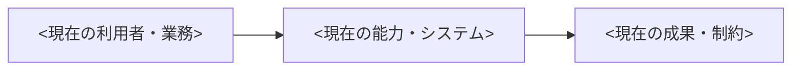
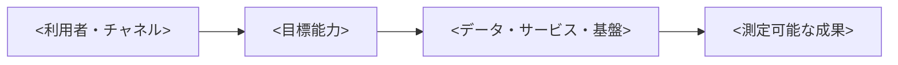

# <Blueprint名>

<対象読者、実現する将来像、この文書を使って合意する事項を3文以内で記載する。>

- オーナー: <組織・役割>
- 作成日: <YYYY-MM-DD>
- 最終更新日: <YYYY-MM-DD>
- 対象期間: <YYYY-MM-DD〜YYYY-MM-DD、または3年間など>
- 対象範囲: <事業・組織・業務・データ・技術など>
- ステータス: Draft / In Review / Approved / Rejected / Deferred / Superseded
- 承認者・会議体: <名称>
- 現行版: <版番号>
- 置き換える文書: <文書名・版、または該当なし>
- Analysis status: Completed / Incomplete / Not performed
- Evidence gaps: <不足する証拠、影響する判断、収集担当・期限、またはなし>
- 分析ハンドオフ: <synthesis-handoff.mdの所在、またはなし>

`Analysis status`は文書の承認ステータスとは別に記録する。`Incomplete`の場合は、不足する証拠と確からしさを明示し、影響する結論・推奨事項を条件付きで記載する。判断を妨げる不足は`consulting-analyst`へ戻すか、この文書に残す。`Not performed`の場合は、分析未実施の範囲と理由を記載し、分析済みとして扱わない。

## <このBlueprintで実現する成果>

<対象期間の終了時に、誰が何を実現できる状態になるかを記載する。>

| 成果ID | 期待する成果 | 現状値 | 目標値 | 測定方法 | 判定時期 | オーナー |
|---|---|---:|---:|---|---|---|
| OUT-001 | <成果> | <値> | <値> | <方法> | <時期> | <役割> |

## 対象範囲と対象外

### 対象範囲

- <対象となる組織、能力、業務、データ、システム、地域>

### 対象外

- <このBlueprintでは扱わない事項と、その扱い先>

### 前提条件と制約

| ID | 種別 | 内容 | 根拠 | 変更時の影響 |
|---|---|---|---|---|
| CON-001 | 前提 / 制約 | <内容> | <資料・決定> | <影響> |

## 変革を必要とする背景

<外部環境、利用者ニーズ、経営課題、技術的負債、規制など、将来像が必要な理由を事実と解釈に分けて記載する。>

| ドライバーID | ドライバー | 根拠 | 対応しない場合の影響 |
|---|---|---|---|
| DRV-001 | <変化・課題> | <データ・資料> | <影響> |

## 設計原則

| 原則ID | 原則 | 判断への適用方法 | 例外を認める条件 |
|---|---|---|---|
| PRN-001 | <原則> | <選択・優先順位への反映> | <条件と承認者> |

## 現在地を示すベースライン

### 現在の能力と成熟度

| 能力ID | 能力 | 現状 | 成熟度 | 根拠 | 主な課題 |
|---|---|---|---|---|---|
| CAP-001 | <能力> | <現在の状態> | 1〜5 | <評価資料> | <課題> |

### 現在の構成

<業務、組織、データ、アプリケーション、基盤、セキュリティ、運用のうち、対象範囲に必要な現在の構成を示す。>

## 目標とする能力と将来像

### 目標能力

| 能力ID | 目標能力 | 提供する価値 | 対象者 | 成熟度目標 | 成功条件 |
|---|---|---|---|---|---|
| CAP-001 | <能力> | <価値> | <対象者> | 1〜5 | <測定可能な条件> |

### 将来のOperating Model

| 観点 | 将来の状態 | 主な変更 | 意思決定者 |
|---|---|---|---|
| 組織・役割 | <状態> | <変更> | <役割> |
| 業務プロセス | <状態> | <変更> | <役割> |
| ガバナンス | <状態> | <変更> | <役割> |
| 人材・スキル | <状態> | <変更> | <役割> |

### 将来のデータ・技術構成

<技術が対象外の場合は、その理由と別文書を記載する。>

| 構成要素 | 責任 | 原則・標準 | 詳細設計の所在 |
|---|---|---|---|
| <要素> | <責任> | <適用する原則> | <文書・未作成> |

### セキュリティ・リスク・運用の将来像

- セキュリティ: <信頼境界、責任分担、主要統制>
- リスク管理: <識別、受容、軽減、報告の方法>
- 運用: <所有権、監視、継続性、改善サイクル>

## 現在地と将来像の差分

| Gap ID | 関連能力 | 現在地 | 将来像 | 必要な変更 | 優先度 |
|---|---|---|---|---|---|
| GAP-001 | CAP-001 | <状態> | <状態> | <変更> | High / Medium / Low |

## 変革ワークストリーム

| WS ID | ワークストリーム | 解消するGap | 成果物 | オーナー | 依存関係 | 完了条件 |
|---|---|---|---|---|---|---|
| WS-001 | <名称> | GAP-001 | <成果物> | <役割> | <WS・外部条件> | <条件> |

## 移行段階とロードマップ

<日付だけでなく、各段階へ進む条件と完了条件を記載する。>

| フェーズ | 目的 | 対象ワークストリーム | 開始条件 | 完了条件 | 目標時期 |
|---|---|---|---|---|---|
| Phase 1 | <目的> | WS-001 | <条件> | <測定可能な条件> | <時期> |

### 移行中の共存と廃止

- 共存が必要な状態: <旧新の併存、データ同期、二重運用>
- 切り替え条件: <判断指標・承認者>
- 廃止対象と条件: <業務・システム・契約・データ>
- ロールバックまたは方針見直し条件: <条件>

## ガバナンスと意思決定

| 判断事項 | 決定者 | 提案者 | 相談先 | 報告先 | 判断時期 |
|---|---|---|---|---|---|
| <判断事項> | <役割> | <役割> | <役割> | <役割> | <時期> |

### 例外と変更管理

- 原則の例外申請: <手順・承認者>
- Blueprint変更: <提案、影響分析、承認、版管理>
- 下位文書との不整合: <検出・解消方法>

## 成果の測定とレビュー

| 指標ID | 関連成果 | 指標 | 目標 | データ源 | 頻度 | 未達時の対応 |
|---|---|---|---:|---|---|---|
| KPI-001 | OUT-001 | <指標> | <値> | <データ源> | <頻度> | <見直し・是正> |

## リスクと未解決事項

| ID | 種別 | 内容 | 影響 | 対応 | オーナー | 期限 |
|---|---|---|---|---|---|---|
| RSK-001 | リスク / 未解決事項 | <内容> | <影響> | <対応> | <役割> | <日付> |

## トレーサビリティ

分析ハンドオフがある場合は、関連するQ / HYP / FND / EVD / GAP / INT / CRT IDsを保持する。INTは介入、CRTは選択肢の評価基準を表す。該当しないリンクは理由付き`N/A`とし、ハンドオフがない場合は分析IDを無理に作らない。

| 論点 Q IDs | 仮説 HYP IDs | 発見 FND IDs | 証拠 EVD IDs | ドライバー | 設計原則 | 目標能力 | Gap | 介入 INT IDs | 評価基準 CRT IDs | ワークストリーム | 指標 |
|---|---|---|---|---|---|---|---|---|---|---|---|
| <関連Q IDs、またはN/A> | <関連HYP IDs、またはN/A> | <関連FND IDs、またはN/A> | <関連EVD IDs、またはN/A> | DRV-001 | PRN-001 | CAP-001 | GAP-001 | <関連INT IDs、またはN/A> | <関連CRT IDs、またはN/A> | WS-001 | KPI-001 |

## 承認と変更履歴

### 承認

ヘッダーのステータスと、次の承認結果を一致させる。承認結果が`Rejected`または`Deferred`の場合、ステータスを`Approved`にしない。

| 役割 | 氏名・会議体 | 判断 | 日付 | 条件 |
|---|---|---|---|---|
| <役割> | <名称> | Approved / Rejected / Deferred | <YYYY-MM-DD> | <条件> |

### 変更履歴

| 版 | 日付 | 変更内容 | 変更者 | 承認者 |
|---|---|---|---|---|
| 0.1 | <YYYY-MM-DD> | 初版 | <氏名> | <氏名・会議体> |
