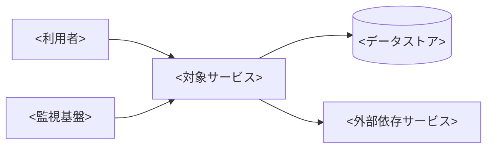

# <サービス名> 運用設計書・Runbook

<サービスを安定して監視・変更・復旧するために、運用担当者が実行する判断と手順を3文以内で要約する。>

- 文書版: <例: 1.0>
- 作成日: <YYYY-MM-DD>
- 最終更新日: <YYYY-MM-DD>
- サービス所有者: <チーム・責任者>
- 運用責任者: <チーム・責任者>
- ステータス: Draft / In Review / Approved
- 対象環境: Production / Staging / <その他>
- 関連設計書: <文書名・版・URL>

## この運用設計で合意する事項

- 運用対象とサービス時間: <対象・時間帯>
- 運用体制: <担当、当番、委託先>
- サービス目標: <SLO・復旧目標>
- 承認を求める事項: <監視、権限、手順、残余リスク>

## サービス概要と依存関係

| 項目 | 内容 |
|---|---|
| 利用者・業務 | <対象利用者と重要業務> |
| 主要機能 | <機能> |
| サービス時間 | <曜日・時間・計画停止> |
| 依存サービス | <クラウド、外部API、ネットワークなど> |
| データストア | <種類・場所> |
| 構成管理 | <IaC・設定リポジトリ> |
| ダッシュボード | <URL> |
| Issue・問い合わせ | <URL・窓口> |

## サービスレベルと運用指標

| SLI | 測定方法 | SLO | 集計期間 | エラーバジェット | 未達時の対応 |
|---|---|---:|---|---:|---|
| <可用性・遅延など> | <式・データソース> | <値> | <期間> | <値> | <変更停止・改善> |

## 運用体制と連絡経路

| 役割 | 担当 | 対応時間 | 責任 | 連絡方法 |
|---|---|---|---|---|
| サービス所有者 | <担当> | <時間帯> | <判断・予算> | <方法> |
| オンコール | <担当> | <時間帯> | <一次対応> | <方法> |
| セキュリティ | <担当> | <時間帯> | <事故対応> | <方法> |

### エスカレーション

| 条件 | 一次連絡 | 二次連絡 | 経営・顧客連絡 | 期限 |
|---|---|---|---|---|
| <重大度・継続時間> | <担当> | <担当> | <担当> | <時間> |

## 監視・ログ・アラート

| 監視ID | 対象 | シグナル | 閾値・条件 | 重要度 | 通知先 | Runbook節 |
|---|---|---|---|---|---|---|
| MON-001 | <対象> | <メトリクス・ログ> | <条件と継続時間> | Critical / Warning | <通知先> | <節名> |

- ログ保存期間: <期間>
- トレース・相関ID: <方式>
- 機密情報のマスキング: <対象・方式>
- 通知抑制・重複排除: <方式>
- アラート試験: <頻度・方法>

## 日次・週次・月次の定常作業

| 頻度 | 作業 | 手順 | 完了条件 | 証跡 | 担当 |
|---|---|---|---|---|---|
| 日次 | <作業> | <コマンド・URL・手順> | <確認結果> | <保存先> | <担当> |
| 週次 | <作業> | <手順> | <確認結果> | <保存先> | <担当> |
| 月次 | <作業> | <手順> | <確認結果> | <保存先> | <担当> |

## インシデントの重大度と初動

| 重大度 | 定義 | 例 | 応答期限 | 更新頻度 | 指揮権 |
|---|---|---|---|---|---|
| SEV-1 | <全停止・重大漏えいなど> | <例> | <時間> | <間隔> | <役割> |
| SEV-2 | <主要機能障害など> | <例> | <時間> | <間隔> | <役割> |
| SEV-3 / 4 | <限定影響> | <例> | <時間> | <間隔> | <役割> |

### 共通初動

1. <アラートと利用者影響を確認する。>
2. <インシデントを起票し、指揮担当と記録担当を決める。>
3. <直近変更、依存先、主要メトリクスを確認する。>
4. <影響拡大を止めるための緩和策を実施する。>
5. <定めた頻度で関係者へ状況を更新する。>
6. <復旧を検証し、事後レビューを登録する。>

## 症状別Runbook

### <症状・アラート名>

- 検知条件: <アラート・問い合わせ>
- 利用者影響: <影響>
- 安全上の注意: <実行禁止条件・承認が必要な操作>

1. <ダッシュボード・ログで事象を確認する。>
2. <切り分けコマンドまたは画面操作を実行する。>
3. <一時的な緩和策を実行する。>
4. <正常化をSLIと利用者操作で確認する。>

- エスカレーション条件: <条件>
- 復旧しない場合: <代替手段・停止判断>
- 証跡: <保存するログ・時刻・操作>

## 起動・停止・再起動

| 操作 | 実行条件 | 手順 | 正常性確認 | 失敗時の対応 | 承認 |
|---|---|---|---|---|---|
| 起動 | <条件> | <手順> | <ヘルスチェック> | <復旧> | <要否> |
| 停止 | <条件> | <手順> | <停止確認> | <復旧> | <要否> |
| 再起動 | <条件> | <手順> | <正常性確認> | <ロールバック> | <要否> |

## バックアップとリストア

| 対象 | 方式 | 頻度 | 保持期間 | 暗号化 | 復元目標 | 復元試験 |
|---|---|---|---|---|---|---|
| <データ・設定> | <方式> | <頻度> | <期間> | <方式> | RTO / RPO | <頻度・証跡> |

### リストア手順

- 前提・承認: <障害状況、復元時点、影響範囲、実行承認者>
- 復元先: <原則として隔離環境へ先行復元し、検証後に本番へ適用する>
- 失敗時の対応: <中止条件、再試行上限、エスカレーション先>
- 証跡: <承認、スナップショット、ログ、検証結果の保存先>

1. <復元時点、影響範囲、復元先について承認を得る。>
2. <現在状態のスナップショットと操作開始時刻を記録する。>
3. <隔離環境へ復元し、バックアップの完全性と復元手順を検証する。>
4. <本番への書き込み停止または対象データの隔離を実施する。>
5. <承認済みの復元先へバックアップを復元する。>
6. <件数、参照整合性、アプリケーション動作を検証する。>
7. <サービスを再開し、監視結果と利用者影響を確認する。>
8. <関係者へ結果を通知し、すべての証跡を保存する。>

## セキュリティ運用

- 特権アクセス: <申請、承認、有効期限、記録>
- シークレット・鍵・証明書: <保管、更新、失効、期限監視>
- 脆弱性対応: <検知元、重大度、修正期限>
- 監査ログ: <対象、保存期間、確認頻度>
- セキュリティ事故: <隔離、証拠保全、連絡先>

## 変更・リリース・ロールバック

| 変更区分 | 承認 | 実施時間帯 | 検証 | ロールバック条件 |
|---|---|---|---|---|
| 標準変更 | <承認者> | <時間帯> | <確認> | <条件> |
| 通常変更 | <承認者> | <時間帯> | <確認> | <条件> |
| 緊急変更 | <承認者> | <時間帯> | <事後確認> | <条件> |

- リリース手順: <パイプライン・段階展開>
- 変更前確認: <バックアップ・依存先・エラーバジェット>
- 変更後確認: <SLI・ログ・利用者シナリオ>
- ロールバック手順: <復旧先・データ互換性>

## 容量・性能・コスト管理

| 指標 | 現在値 | 警告閾値 | 上限 | 拡張方法 | 確認頻度 |
|---|---:|---:|---:|---|---|
| <CPU・容量・件数・費用> | <値> | <値> | <値> | <方法> | <頻度> |

## 災害復旧と事業継続

- 災害シナリオ: <リージョン障害・拠点喪失など>
- RTO / RPO: <値>
- 切替判断者: <役割>
- 切替・切戻し手順: <手順参照>
- 代替業務: <手作業・縮退運転>
- 訓練頻度と証跡: <頻度・保存先>

## リスクと未解決事項

| ID | 内容 | 影響 | 対応・期限 | 所有者 | ステータス |
|---|---|---|---|---|---|
| OPS-RSK-001 | <内容> | <影響> | <対応> | <担当> | Open |

## Runbookの有効性と陳腐化検知

- 定期レビュー期限: <例: 90日ごと>
- 臨時レビュー条件: <構成、依存先、権限、アラート、復旧方式の変更>
- 期限超過時の扱い: <警告、利用停止、再検証が必要な手順>

| Runbook・手順 | 最終実行・訓練日 | 検証した構成版 | 次回期限 | 所有者 | 状態 |
|---|---|---|---|---|---|
| <手順名> | <YYYY-MM-DD> | <バージョン・構成> | <YYYY-MM-DD> | <担当> | Current / Review Due / Stale |

## レビューと変更履歴

| 版 | 日付 | 変更内容・訓練結果 | レビュー担当 | 次回見直し |
|---|---|---|---|---|
| 0.1 | <YYYY-MM-DD> | 初版 | <担当> | <YYYY-MM-DD> |
