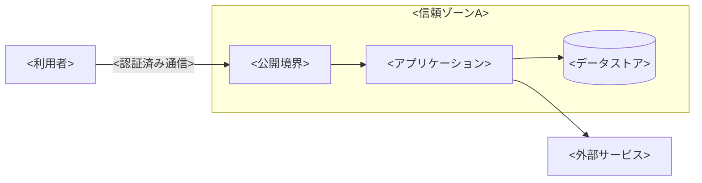

# <システム名> セキュリティ設計書・脅威モデル

<保護する資産、主要な脅威、採用するセキュリティ制御、受容する残余リスクを3文以内で要約する。>

- 文書版: <例: 1.0>
- 作成日: <YYYY-MM-DD>
- 最終更新日: <YYYY-MM-DD>
- 作成者: <氏名・チーム>
- セキュリティレビュー担当: <氏名・チーム>
- リスク受容者: <氏名・役職>
- ステータス: Draft / In Review / Approved
- 対象リリース: <バージョン・時期>
- 関連要件・設計: <文書名・版・URL>

## このセキュリティ設計で合意する事項

- 対象範囲と信頼境界: <対象システム・データ・利用者>
- 主要な脅威と制御: <要約>
- 残余リスク: <受容・追加対策が必要な事項>
- 承認を求める事項: <設計、例外、リスク受容>

## 対象範囲と対象外

### 対象範囲

- <アプリケーション、基盤、データ、外部接続、運用>

### 対象外

- <別チーム・別文書が管理する範囲>

## セキュリティ要件と準拠基準

| 要件ID | 要件・基準 | 適用範囲 | 設計上の対応 | 検証方法 |
|---|---|---|---|---|
| SEC-REQ-001 | <社内規程・法令・NFR> | <対象> | <制御> | <試験・監査> |

## 資産とデータ分類

| 資産ID | 資産・データ | 所有者 | 機密性 | 完全性 | 可用性 | 保存場所 | 保持・削除 |
|---|---|---|---|---|---|---|---|
| AST-001 | <資産> | <所有者> | High / Medium / Low | High / Medium / Low | High / Medium / Low | <場所> | <期間・方法> |

## アーキテクチャと信頼境界

| 境界ID | 境界 | 越境するデータ | 通信方式 | 認証・認可 | 保護制御 |
|---|---|---|---|---|---|
| TB-001 | <境界> | <データ> | <TLS・Private Linkなど> | <方式> | <検証・制限> |

## ID・認証・認可

| 主体 | ID基盤 | 認証方式 | 認可モデル | 最小権限 | 有効期限・棚卸し |
|---|---|---|---|---|---|
| 利用者 / サービス / 管理者 | <基盤> | <MFA・証明書など> | RBAC / ABAC | <制御> | <期限・頻度> |

- 特権アクセス: <申請、承認、Just-In-Time、記録>
- サービス間認証: <Managed Identity、証明書など>
- セッション管理: <有効期限、失効、Cookie属性>
- アカウント回復: <本人確認、監査、通知>

## 脅威モデル

脅威分類にはSTRIDEなどを使用し、資産・境界・データフローごとに分析する。

| 脅威ID | 分類 | 対象資産・境界 | 攻撃シナリオ | 前提 | 影響 | 可能性 | リスク |
|---|---|---|---|---|---|---|---|
| THR-001 | Spoofing / Tampering / Repudiation / Information Disclosure / DoS / Elevation | AST-001 / TB-001 | <シナリオ> | <条件> | High / Medium / Low | High / Medium / Low | <評価> |

## セキュリティ制御と脅威対応

| 制御ID | 対応脅威ID | 予防・検知・対応 | 制御内容 | 所有者 | 実装箇所 | 検証方法 |
|---|---|---|---|---|---|---|
| CTRL-001 | THR-001 | Prevent / Detect / Respond | <制御> | <担当> | <構成・コード> | <試験・監査> |

## データ保護

- 転送時暗号化: <プロトコル、最小バージョン、証明書管理>
- 保存時暗号化: <方式、鍵、適用対象>
- フィールド暗号化・トークン化: <対象・方式>
- データマスキング: <画面、ログ、非本番環境>
- データ所在地: <リージョン・越境条件>
- 保持と削除: <期間、論理・物理削除、証跡>

## シークレット・鍵・証明書管理

| 対象 | 保管場所 | 利用主体 | 配布方法 | ローテーション | 失効 | 監視 |
|---|---|---|---|---|---|---|
| <シークレット・鍵> | <Vault・HSM> | <主体> | <Managed Identityなど> | <頻度・自動化> | <手順> | <期限通知> |

- ソースコード・イメージ・ログへの混入防止: <スキャン・マスキング>
- 緊急ローテーション: <判断者・手順・所要時間>

## 入力・出力・APIの保護

| 対象 | 脅威 | 制御 | 制限値 | エラー時の扱い |
|---|---|---|---|---|
| 入力 | Injection / 不正形式 | <検証・エスケープ> | <サイズ・件数> | <拒否・記録> |
| API | Abuse / Replay | <認可・レート制限・冪等性> | <値> | <応答・遮断> |
| 出力 | 情報漏えい | <最小化・エンコード> | <条件> | <マスキング> |

## ログ・監査・検知

| イベント | 記録内容 | 記録しない情報 | 保存期間 | 検知ルール | 通知先 |
|---|---|---|---|---|---|
| 認証・権限変更・データ操作 | <主体、時刻、結果、相関ID> | <パスワード・秘密値> | <期間> | <異常条件> | <SOC・担当> |

- ログ改ざん防止: <アクセス制御・WORMなど>
- 時刻同期: <方式>
- 相関・追跡: <Trace ID・User ID>
- 検知ルールの試験: <頻度・方法>

## 脆弱性とサプライチェーン管理

- 依存関係スキャン: <ツール・頻度・修正期限>
- SAST / DAST / IaCスキャン: <対象・実行時点>
- コンテナ・成果物署名: <方式・検証>
- SBOM: <生成・保存・提供方法>
- パッチ管理: <重大度別期限・例外承認>
- 外部サービス・OSS: <評価・ライセンス・終了時対応>

## セキュリティ試験

| 試験ID | 対応要件・脅威・制御 | 試験意図 | 想定環境 | 合格基準 | 必要な証跡種別 |
|---|---|---|---|---|---|
| SEC-TC-001 | SEC-REQ-001 / THR-001 / CTRL-001 | <認可・侵入・設定試験> | <環境条件> | <基準> | <ログ・報告書など> |

## セキュリティインシデント対応

- 検知と一次対応: <監視、隔離、連絡>
- 証拠保全: <ログ、スナップショット、Chain of Custody>
- 封じ込め・根絶・復旧: <責任者・手順>
- 法務・規制・顧客通知: <条件・期限・承認者>
- 事後レビュー: <期限・再発防止管理>

## 残余リスクと例外

| リスクID | 対応脅威 | 残余リスク | 受容理由・代替制御 | 有効期限 | 受容者 | 見直し条件 |
|---|---|---|---|---|---|---|
| SEC-RSK-001 | THR-001 | <残るリスク> | <理由・補完策> | <日付> | <役職・氏名> | <条件> |

## セキュリティトレーサビリティ

| 要件ID | 資産ID | 脅威ID | 制御ID | 試験ID | 実装・設定先 |
|---|---|---|---|---|---|
| SEC-REQ-001 | AST-001 | THR-001 | CTRL-001 | SEC-TC-001 | <コード・IaC・ポリシー> |

## レビューと承認記録

| 版 | 日付 | レビュー・承認者 | 判断 | 条件・残余リスク |
|---|---|---|---|---|
| <版> | <YYYY-MM-DD> | <氏名・会議体> | Approved / Rejected / Deferred | <条件> |

## 変更履歴

| 版 | 日付 | 変更内容 | 変更理由 | 作成者 |
|---|---|---|---|---|
| 0.1 | <YYYY-MM-DD> | 初版 | <理由> | <氏名> |
