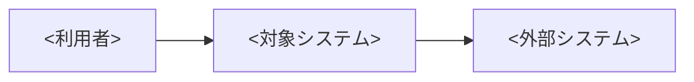
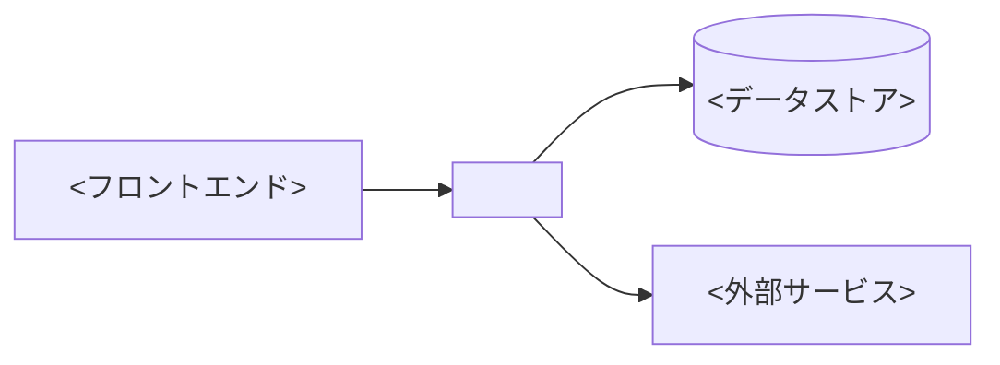
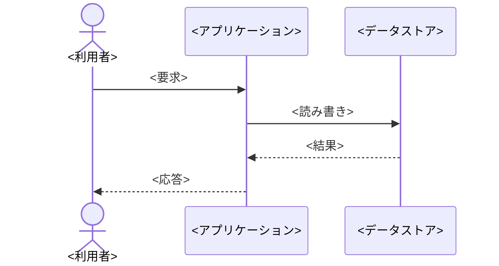
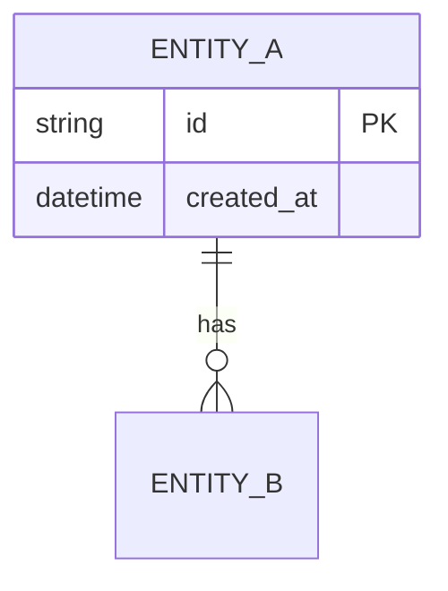
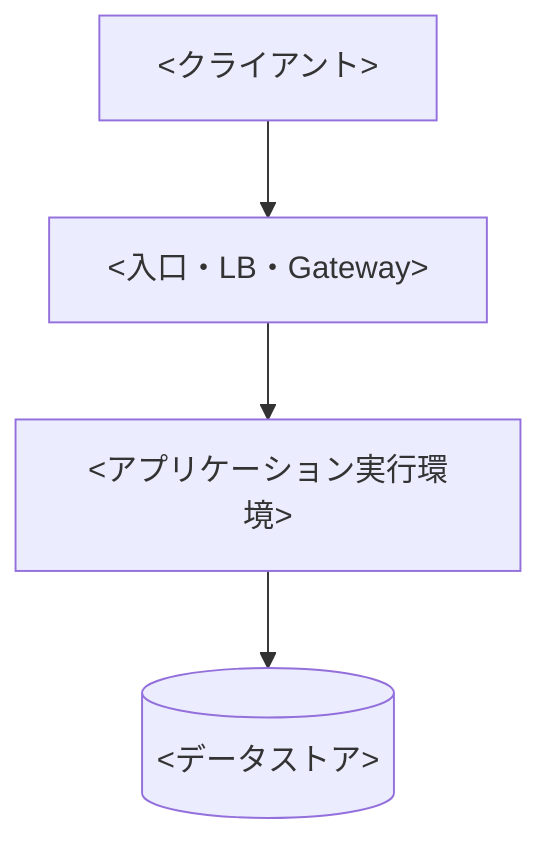

# <システム名> システム設計書

<承認済み要件をどの構成と方式で実現するか、設計の要点と主要な判断を3文以内で要約する。>

- 文書版: <例: 1.0>
- 作成日: <YYYY-MM-DD>
- 最終更新日: <YYYY-MM-DD>
- 作成者: <氏名・チーム>
- レビュー担当: <アーキテクト・開発・運用・セキュリティ担当>
- ステータス: Draft / In Review / Approved
- 対象リリース: <バージョン・時期>
- 対応する要件定義書: <文書名・版・URL>

## この設計で合意する事項

- 設計対象: <システム・サブシステム・機能>
- 主要な設計判断: <採用する方式>
- レビューで確認する事項: <構成、品質属性、運用可能性など>

## 設計の前提と対象範囲

### 対象範囲

- <設計対象のコンポーネント・データ・インターフェース>

### 対象外

- <別文書・別フェーズで設計する事項>

### 前提条件と制約

| ID | 区分 | 内容 | 設計への影響 |
|---|---|---|---|
| DC-001 | 要件 / 技術 / 予算 / 納期 / 法令 | <条件> | <影響> |

## 設計ドライバーと対応要件

| 設計ドライバー | 対応要件ID | 優先順位 | 設計上の対応 |
|---|---|---:|---|
| <性能・可用性・セキュリティなど> | NFR-001 | 1 | <方式> |

## システム全体構成

### システムコンテキスト

### コンテナ・実行単位

| コンポーネント | 責務 | 採用技術 | 実行環境 | 依存先 | 対応要件ID |
|---|---|---|---|---|---|
| <名称> | <単一の責務> | <製品・フレームワーク> | <環境> | <依存先> | FR-001 |

## コンポーネント設計

### <コンポーネント名>

- 責務: <担当する処理>
- 公開インターフェース: <API・イベント・画面>
- 依存関係: <他コンポーネント・外部サービス>
- 状態管理: <保持する状態・整合性>
- エラー処理: <失敗の通知・再試行・補償>
- 対応要件ID: <FR-001, NFR-001>

## 主要な処理フロー

### <ユースケース・処理名>

| ステップ | 処理 | 入出力 | 失敗時の動作 | 対応要件ID |
|---:|---|---|---|---|
| 1 | <処理> | <入出力> | <再試行・中断・補償> | FR-001 |

## データ設計

### データモデル

| エンティティ・データ | 用途 | 主キー | 整合性ルール | 機密区分 | 保持・削除 | 対応要件ID |
|---|---|---|---|---|---|---|
| <名称> | <用途> | <キー> | <制約> | <区分> | <期間・方法> | DATA-001 |

### トランザクションと整合性

- トランザクション境界: <開始・確定・取消の単位>
- 同時実行制御: <ロック・楽観制御・冪等性>
- 結果整合性: <許容する不整合時間・補正方法>

## インターフェース設計

| IF-ID | 提供側 / 利用側 | 方式 | エンドポイント・イベント | 入出力 | 認証・認可 | タイムアウト・再試行 | バージョニング |
|---|---|---|---|---|---|---|---|
| IF-001 | <提供 / 利用> | REST / Event / File | <名称> | <スキーマ参照> | <方式> | <値・条件> | <方針> |

### エラー契約

| エラーコード | 発生条件 | 呼び出し元への応答 | 再試行可否 | 運用通知 |
|---|---|---|---|---|
| <コード> | <条件> | <ステータス・メッセージ> | Yes / No | <通知条件> |

## セキュリティ設計

| 項目 | 設計 | 対応する脅威・要件 | 検証方法 |
|---|---|---|---|
| 認証 | <方式> | <脅威・NFR-ID> | <試験・監査> |
| 認可 | <ロール・権限モデル> | <脅威・NFR-ID> | <試験・監査> |
| データ保護 | <転送時・保存時暗号化、鍵管理> | <データ区分・NFR-ID> | <確認方法> |
| シークレット管理 | <保管、配布、ローテーション、失効> | <脅威・NFR-ID> | <確認方法> |
| 監査 | <記録対象、保存期間、改ざん対策> | <規程・NFR-ID> | <確認方法> |

## 性能と容量の設計

| 指標 | 想定負荷 | 設計目標 | 実現方式 | 限界・スケール条件 | 検証方法 |
|---|---:|---:|---|---|---|
| <応答時間・TPSなど> | <値> | <値> | <キャッシュ・並列化など> | <閾値> | <負荷試験> |

## 可用性と信頼性の設計

- 可用性目標: <SLO・対象時間帯>
- 障害分離: <冗長化・障害ドメイン>
- タイムアウトと再試行: <値・バックオフ・上限>
- 冪等性と重複排除: <方式>
- RTO / RPO: <値>
- バックアップ: <対象・頻度・保持期間・復元試験>
- 災害復旧: <切替方式・責任者・訓練頻度>

## 配置とネットワーク設計

| 環境 | リージョン・場所 | ネットワーク境界 | 配置物 | スケール方式 | 構成管理 |
|---|---|---|---|---|---|
| Development / Staging / Production | <場所> | <VNet・Subnet・FW> | <構成> | <方式> | <IaC・設定管理> |

## 監視と運用の設計

| 種別 | 対象 | シグナル | 閾値・条件 | 通知先 | 初動手順 |
|---|---|---|---|---|---|
| メトリクス / ログ / トレース | <対象> | <指標> | <条件> | <担当> | <Runbook> |

- SLI / SLO: <測定式・目標>
- ログ方針: <構造、機密情報のマスキング、保持期間>
- リリース方式: <段階展開、Feature Flag、承認>
- 定常作業: <バックアップ確認、パッチ、証明書更新>
- 障害対応: <検知、切り分け、連絡、事後レビュー>

## 移行・リリース・ロールバック設計

| フェーズ | 作業 | 入力 | 完了条件 | 検証 | ロールバック条件 |
|---|---|---|---|---|---|
| <フェーズ> | <作業> | <データ・成果物> | <判定可能な条件> | <方法> | <条件> |

- データ移行方式: <全件・差分・二重書きなど>
- 互換性維持: <API・スキーマ・クライアント>
- 切替手順: <順序・責任者・所要時間>
- ロールバック手順: <復旧先・データ整合性の扱い>

## テスト方針と要件トレーサビリティ

| 要件ID | 設計箇所 | テストレベル | テスト内容 | 合格基準 | 証跡 |
|---|---|---|---|---|---|
| FR-001 | <節・コンポーネント> | Unit / Integration / System / Acceptance | <内容> | <基準> | <成果物> |

## 採用しなかった方式とトレードオフ

| 選択肢 | 評価軸 | 採否 | 理由 | 受け入れる影響 |
|---|---|---|---|---|
| <方式> | コスト / 性能 / 運用性 / リスク | 採用 / 不採用 | <理由> | <制約・負債> |

## リスクと未解決事項

| ID | 区分 | 内容 | 影響 | 対応・決定期限 | 所有者 | ステータス |
|---|---|---|---|---|---|---|
| RSK-001 | リスク / 未解決事項 | <内容> | <影響> | <対応・期限> | <担当> | Open |

## レビューと承認記録

| 版 | レビュー・承認日 | 担当 | 判断 | 条件・コメント |
|---|---|---|---|---|
| <版> | <YYYY-MM-DD> | <氏名・会議体> | Approved / Rejected / Deferred | <条件> |

## 変更履歴

| 版 | 日付 | 変更内容 | 変更理由 | 作成者 |
|---|---|---|---|---|
| 0.1 | <YYYY-MM-DD> | 初版 | <理由> | <氏名> |
