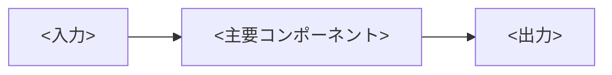

# <提案名>

<解決する課題、提案内容、期待する成果を3文以内で要約する。>

- 提案者: <氏名・チーム>
- 提案日: <YYYY-MM-DD>
- 対象読者: <意思決定者・レビュー担当者>
- ステータス: Draft / In Review / Approved / Rejected
- 承認を求める事項: <承認・却下してほしい判断>

## <この提案が必要な背景>

<現在の状況、観測された問題、今対応する理由を事実ベースで記載する。>

## 達成する目標と対象外

### 目標

- <測定可能な目標>
- <利用者または事業にもたらす成果>

### 対象外

- <今回の提案では扱わない事項>

## 提案する技術的アプローチ

<採用する方式を最初の1文で明示し、その後に構成と処理の流れを説明する。>

### 主要コンポーネント

| コンポーネント | 役割 | 採用技術 | 選定理由 |
|---|---|---|---|
| <名称> | <役割> | <製品・サービス> | <理由> |

### データとインターフェース

- 入力データ: <形式・取得元>
- 出力データ: <形式・保存先>
- 外部連携: <API・プロトコル・認証方式>

## セキュリティとコンプライアンス

- 認証・認可: <方式と権限モデル>
- データ保護: <暗号化・保持期間・削除方法>
- 監査: <ログ・追跡方法>
- 適用基準: <法令・社内規程・認証>

## 実施計画

| フェーズ | 作業 | 成果物 | 完了条件 | 期間 |
|---|---|---|---|---|
| <フェーズ名> | <作業内容> | <成果物> | <確認可能な条件> | <期間> |

### ロールアウトとロールバック

- ロールアウト: <段階導入・移行方法>
- ロールバック条件: <中止を判断する指標>
- ロールバック手順: <元の状態へ戻す方法>

## 必要な費用と体制

- TCO評価期間: <例: 導入から5年間>
- 通貨・税区分: <通貨・税込/税別>

| 項目 | 初期費用 | 年間継続費用 | 評価期間TCO | 前提条件 | 必要な担当・工数 |
|---|---:|---:|---:|---|---|
| <項目> | <金額> | <年額> | <金額> | <条件> | <役割・人日> |
| **合計** | **<合計>** | **<合計>** | **<初期費用＋評価期間の継続費用>** |  |  |

## 共通の評価軸で代替案を比較する

| 選択肢 | 評価期間TCO | 導入期間 | 実装・運用工数 | リスク | 採否と理由 |
|---|---:|---|---|---|---|
| 現状維持 | <金額> | なし | <工数> | <継続する課題> | 不採用 / 採用: <理由> |
| 提案方式 | <金額> | <期間> | <工数> | <リスク> | 採用 / 不採用: <理由> |
| <代替案> | <金額> | <期間> | <工数> | <リスク> | 採用 / 不採用: <理由> |

## リスクと対策

| リスク | 影響 | 発生可能性 | 対策 | 所有者 |
|---|---|---|---|---|
| <リスク> | High / Medium / Low | High / Medium / Low | <予防・軽減策> | <担当> |

## 成功を判断する指標

| 指標 | 現状値 | 目標値 | 測定方法 | 判定時期 | 未達時の対応 |
|---|---:|---:|---|---|---|
| <指標> | <値> | <値> | <方法> | <日付・時点> | <改善・縮小・撤退判断> |

## 意思決定事項と未解決事項

### 承認条件の補足

<ヘッダーの「承認を求める事項」は繰り返さず、条件付き承認に必要な補足だけを記載する。>

### 未解決事項

- <追加調査または合意が必要な事項>

### 決定記録

- 決定: Approved / Rejected / Deferred
- 決定者: <氏名・会議体>
- 決定日: <YYYY-MM-DD>
- 条件・コメント: <承認条件または却下理由>
