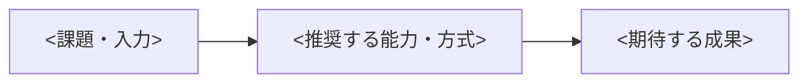

# <White Paperタイトル>

<対象読者が抱える問題、本書の中心的な結論、読後に判断できることを3文以内で記載する。>

- 発行者: <組織名>
- 著者・監修者: <氏名・役割>
- 発行日: <YYYY-MM-DD>
- 最終更新日: <YYYY-MM-DD>
- 版: <版番号>
- ステータス: Draft / In Review / Approved for Publication / Withdrawn
- 公開承認者: <氏名・役割・会議体>
- 法務・コンプライアンス・主張レビュー: <レビュー者・該当なし>
- 対象読者: <読者>
- 対象地域・業界: <範囲>
- 調査対象期間: <YYYY-MM-DD〜YYYY-MM-DD>
- 公開区分: Public / Limited / Confidential
- Analysis status: Completed / Incomplete / Not performed
- Evidence gaps: <不足する証拠、影響する判断、収集担当・期限、またはなし>
- 分析ハンドオフ: <synthesis-handoff.mdの所在、またはなし>

`Analysis status`は公開承認ステータスとは別に記録する。`Incomplete`の場合は、不足する証拠と確からしさを明示し、影響する結論・推奨事項を条件付きで記載する。判断を妨げる不足は`consulting-analyst`へ戻すか、この文書に残す。`Not performed`の場合は、分析未実施の範囲と理由を記載し、分析済みとして扱わない。

## 要旨

<問題、調査・分析の範囲、主要な発見、結論、読者への示唆を300〜500字で記載する。本文を読まなくても中心的な判断が分かるようにする。>

## 本書が答える問い

- 中心的な問い: <読者が判断したい問い>
- 中心的な主張: <証拠で支持または反証できる具体的な主張>
- 読者に求める次の行動: <検討、評価、実証、導入判断など>

## 対象範囲と用語

### 対象範囲

- 含む: <地域、業界、組織規模、技術、期間>
- 含まない: <対象外と、その理由>
- 情報の基準日: <YYYY-MM-DD>

### 主要用語

| 用語 | 本書での定義 | 類似語との違い |
|---|---|---|
| <用語> | <定義> | <違い> |

## 調査・分析方法

<どの情報を、どの基準で収集・評価・統合したかを記載する。>

| 方法 | 対象・件数 | 選定基準 | 分析方法 | 主な制約 |
|---|---:|---|---|---|
| 文献調査 / インタビュー / データ分析 / 実証 | <対象> | <基準> | <方法> | <制約> |

### 証拠の評価基準

- 一次情報を優先する条件: <条件>
- 情報の新しさを判断する基準: <基準>
- 利害関係のある情報の扱い: <検証・注記方法>
- 不一致または反証となる情報の扱い: <方法>

## <問題が重要になる背景>

<市場、制度、利用者、技術、運用などの変化を、出典付きの事実と分析者の解釈に分けて説明する。>

## 調査から得られた主要な発見

### <発見1を結論として表す見出し>

<発見を最初に記載し、その後に証拠、解釈、適用範囲を説明する。>

| 項目 | 内容 |
|---|---|
| 主張ID | CLM-001 |
| 主張 | <具体的な主張> |
| 関連仮説 HYP IDs | <関連HYP IDs、または理由付きN/A> |
| 分析上の発見 FND IDs | <関連FND IDs、または理由付きN/A> |
| 根拠 | EVD-001、EVD-002 |
| 確からしさ | High / Medium / Low |
| 適用範囲 | <どこまで当てはまるか> |
| 制約・反証 | <弱める条件、矛盾する証拠> |

### <発見2を結論として表す見出し>

<必要な数だけ同じ構造で記載する。>

## 選択肢と評価

| 選択肢 | 適する状況 | 期待効果 | 費用・負担 | リスク | 根拠 |
|---|---|---|---|---|---|
| 現状維持 | <状況> | <効果> | <負担> | <リスク> | <証拠ID> |
| <選択肢> | <状況> | <効果> | <負担> | <リスク> | <証拠ID> |

## 推奨する考え方またはソリューションパターン

<推奨事項を、適用条件とともに記載する。製品やサービスを例示する場合は、一般的な結論と製品固有の主張を分ける。>

### 適用条件

- 適する条件: <条件>
- 適さない条件: <条件>
- 事前に検証する事項: <PoC・評価・法務確認など>

## 導入・適用時に検討する事項

| 観点 | 確認事項 | 判断材料 | 主なリスク |
|---|---|---|---|
| 組織・人材 | <確認事項> | <証拠・測定> | <リスク> |
| 業務・ガバナンス | <確認事項> | <証拠・測定> | <リスク> |
| データ・技術 | <確認事項> | <証拠・測定> | <リスク> |
| セキュリティ・法令 | <確認事項> | <証拠・測定> | <リスク> |
| 費用・運用 | <確認事項> | <証拠・測定> | <リスク> |

## 事例または検証結果

<事例、実証、シミュレーションのどれかを明示する。代表性を保証しない場合は、その制約を記載する。>

| 項目 | 内容 |
|---|---|
| 対象 | <組織・環境・条件> |
| 実施内容 | <方法> |
| 結果 | <測定値> |
| 比較基準 | <導入前・対照・目標> |
| 制約 | <一般化できない理由> |
| 出典 | <証拠ID・URL> |
| 顧客名・数値・事例の掲載許諾 | <許諾者・許諾日・条件、または匿名化の方法> |

## 反対意見・代替解釈・限界

- 反対意見: <有力な異論と、その根拠>
- 代替解釈: <同じ証拠から導ける別の結論>
- データの限界: <欠損、偏り、サンプル、期間>
- 将来変化する可能性: <技術、制度、市場など>
- 結論を見直す条件: <新しい証拠・閾値>

## 結論と次の判断

<中心的な問いへの回答を簡潔に示し、対象読者が次に行う評価・合意・実証・意思決定を記載する。新しい主張は追加しない。>

## 利害関係と開示

- 発行者と対象製品・サービスの関係: <関係・該当なし>
- 資金提供・協賛: <提供者・該当なし>
- 著者の利害関係: <内容・該当なし>
- データ提供者の関与: <収集、分析、レビューへの関与>
- AI利用: <調査・執筆・翻訳・校正での利用範囲>

## 証拠台帳

SRCは出典の記録、EVDは分析上の証拠の記録を表す。分析ハンドオフがある場合は、関連するHYP / FND / EVD IDsを主張・発見に紐付け、元のIDと意味を保持する。出典をEVDに置き換えない。該当しないリンクは理由付き`N/A`とし、ハンドオフがない場合はHYP / FND IDsを無理に作らない。

### 出典の記録

| 出典ID | 出典 | 種別 | 発行日 | 参照日 | 関連する証拠ID | 品質・制約 |
|---|---|---|---|---|---|---|
| SRC-001 | <著者、資料名、URL> | 一次 / 二次 | <YYYY-MM-DD> | <YYYY-MM-DD> | EVD-001 | <評価> |

### 分析上の証拠の記録

| 証拠ID | 出典ID | 記述の種別 | 証拠または解釈 | 関連仮説 HYP IDs | 関連発見 FND IDs | 関連主張 | 品質・制約 |
|---|---|---|---|---|---|---|---|
| EVD-001 | SRC-001 | Fact / Estimate / Interpretation | <証拠、または解釈とその根拠EVD IDs> | <関連HYP IDs、またはN/A> | <関連FND IDs、またはN/A> | CLM-001 | <評価> |

Interpretationは解釈として保持し、仮説を支持する証拠には数えない。`Supported`の仮説には、その仮説を支持するFact / EstimateのEVDが必要となる。

## 参考文献

1. <著者・組織>『<資料名>』<発行年>、<URL>（参照日: <YYYY-MM-DD>）

## 公開承認とレビュー記録

ステータスを`Approved for Publication`にするには、公開承認と、必須レビューの`Approved`または理由付き`N/A`が揃っていることを確認する。`Withdrawn`の場合は、撤回日と理由を記録する。

| 種別 | レビュー者・承認者 | 対象 | 判断 | 日付 | 条件・N/Aの理由 |
|---|---|---|---|---|---|
| 公開承認 | <氏名・役割・会議体> | 文書全体 | Approved / Rejected | <YYYY-MM-DD> | <条件> |
| 法務レビュー | <氏名・役割> | <対象箇所・文書全体> | Approved / Rejected / N/A | <YYYY-MM-DD> | <条件・N/Aの理由> |
| コンプライアンスレビュー | <氏名・役割> | <対象箇所・文書全体> | Approved / Rejected / N/A | <YYYY-MM-DD> | <条件・N/Aの理由> |
| 主張・数値検証 | <氏名・役割> | <CLM・EVD・事例ID> | Approved / Rejected / N/A | <YYYY-MM-DD> | <条件・N/Aの理由> |
| 顧客名・事例掲載許諾 | <許諾者・確認者> | <事例・顧客名・数値> | Approved / Rejected / N/A | <YYYY-MM-DD> | <条件・匿名化・N/Aの理由> |

## 変更履歴

| 版 | 日付 | 変更内容 | 変更者 | レビュー者 |
|---|---|---|---|---|
| 0.1 | <YYYY-MM-DD> | 初版 | <氏名> | <氏名> |
